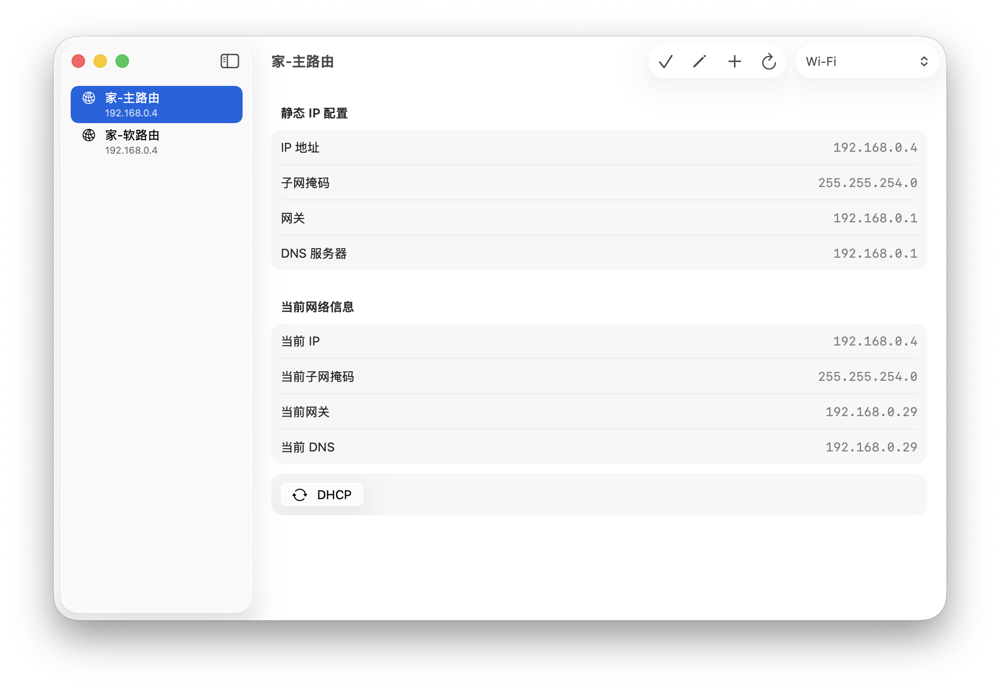

> [!WARNING]
> This app is not signed or notarized by Apple. On first launch, macOS may report it as "damaged" and refuse to open it.
> Run the following command once in Terminal, then open the app again:
>
> ```bash
> xattr -dr com.apple.quarantine "/Applications/NetProfile Switcher.app"
> ```

# NetProfile Switcher for macOS

<div align="center">


**A SwiftUI-based macOS network configuration preset switcher<br/>Quickly switch between multiple IPv4 network configurations, DNS, and DHCP**

[](LICENSE)
[](https://swift.org)
[](https://developer.apple.com/swiftui/)
[]()

**English** | [简体中文](README.md)

</div>

---

## 📖 Introduction

NetProfile Switcher for macOS is a network configuration preset tool for the macOS desktop. It allows you to save different network configurations (IPv4 address, subnet mask, gateway, and DNS) and switch to a specific configuration with a single click whenever needed.

It is ideal for scenarios where you frequently switch between direct connections, bypass gateways, proxy gateways, lab networks, corporate networks, and home networks. Instead of repeatedly opening macOS System Settings to manually modify network parameters, simply maintain your presets and apply them with a click.

## 🖼️ Screenshot



## ✨ Features

- **Multi-configuration Management**: Save configuration names, IPv4 addresses, subnet masks, gateways, and DNS servers.
- **Quick Preset Switching**: Select a configuration in the sidebar and click Apply to switch; the context-menu shortcut remains available.
- **One-time Passwordless Authorization**: Configures a restricted `sudoers` rule on the first network change, then runs `networksetup` without further password prompts.
- **Quick DHCP Recovery**: Switch back to DHCP with a single click and clear custom DNS settings.
- **macOS Shortcuts Integration**: Exposes two App Intents — `Apply Network Configuration` and `Switch Network Service to DHCP` — which can be used in Shortcuts combined with conditions, time triggers, location-based automation, and more.

## 🚀 Quick Start

### System Requirements

- macOS 26 (Tahoe) or later
- Available Wi-Fi, Ethernet, or other macOS network services

### Installation

#### 🛠️ Download from GitHub Releases

Download the latest `.dmg` installer from [GitHub Releases](https://github.com/sixiaolong1117/NetProfile-Switcher-for-macOS/releases).

On the first launch, if Gatekeeper blocks the app, run the `xattr` command shown in the warning at the top of this page first.

#### 🛠️ Build from Source

1. Clone the repository:

```bash
git clone https://github.com/sixiaolong1117/NetProfile-Switcher-for-macOS.git
```

2. Open `NetworkSelectorForMacOS.xcodeproj` with Xcode 26.5 or later.
3. Select `My Mac` as the run target.
4. Click Run or press `⌘R` to build and run.

## 📖 User Guide

### ➕ Add a Static Network Configuration

1. Click the **＋** button in the toolbar.
2. Fill in a configuration name, e.g., "Bypass Gateway" or "Corporate Network".
3. Fill in the IPv4 address, subnet mask, gateway, and DNS servers.
4. Click **Save** to save the configuration.

### 🔁 Switch Configurations

| Action | Description |
|--------|-------------|
| Select config → Apply | Select a configuration, then click the toolbar Apply button to immediately apply the static network configuration; the context-menu shortcut is also available |
| DHCP button | Switch the current network service back to DHCP and clear DNS |
| Right-side Current Network Info panel | View the IP address, subnet mask, gateway, and DNS currently active on the network service |

> After applying a configuration, the network panel in macOS System Settings may need to be reopened to show the updated results.

### ⚙️ Shortcuts Automation

The app provides two Shortcuts actions that can be found and used in the macOS Shortcuts app:

| Action | Description |
|--------|-------------|
| Apply Network Configuration | Switch a specified network service to a saved static IP configuration |
| Switch Network Service to DHCP | Switch a specified network service back to DHCP and clear custom DNS |

You can combine these with conditional logic, time triggers, menu selections, and other automation rules to achieve automatic network configuration switching.

## 🔒 Privacy

NetProfile Switcher for macOS does not collect, use, or share any personal information. All configuration data is stored solely in local UserDefaults.

## 🤝 Contributing

Issues and Pull Requests are welcome.

## 📄 License

This project is open-sourced under the [MIT License](LICENSE).
